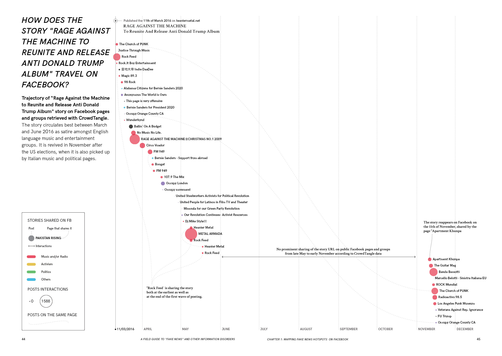

# Chapter 1. MAPPING FAKE NEWS HOTSPOTS ON FACEBOOK

What publics does fake news animate on Facebook?

How may the trajectory of a fake news story be traced on Facebook?

Do fact-checking initiatives reach the publics of fake news on Facebook?

## Introduction

This section provides a set of recipes for tracing the circulation of fake news on Facebook. The focus is on circulation because false and misleading knowledge claims are not born “fake news”. To become fake news they need to mobilise a large number of publics – including witnesses, allies, likes and shares, as well as opponents to contest, flag and debunk them. Facebook’s architecture poses challenges to the study of circulation of content due to the nature of its access and permissions system. Hence we focus on tracing the publics of fake news through its most publicly accessible entities: pages and groups, which may be considered to constitute already assembled publics.

Around the 2016 US presidential elections commentators have noted the emergence of a Facebook-native, hyper-partisan “political media machine” that was highly effective in gathering large numbers of *`followers`* and generating *`engagement`* [1]. This fake news dissemination machine and responses to it, is what the recipes in this section enable to explore. The first two recipes focus on mapping the publics that are energised by fake news on Facebook, as well as the trajectories through which fake news stories travel on Facebook. The third recipe provides an approach to address the effectiveness of fact-checking initiatives in reaching the publics of fake news on Facebook. Through these recipes we aim to gesture towards different ways of providing “thicker” accounts of circulation and engagement around fake news on social media beyond the “thin descriptions” of aggregated counts and metrics.

> [1] See, John Herrman, “Inside Facebook’s (Totally Insane, Unintentionally Gigantic, Hyperpartisan) Political-Media Machine”, Agust 2016, *The New York Times*: https://www.nytimes.com/2016/08/28/magazine/inside-facebooks-totally-insane-unintentionally-gigantic-hyperpartisan-political-media-machine.html 

## Recipe 1.1: What publics does fake news animate on Facebook?

### Before starting
The starting point for this recipe is a list of fake news stories. There are different ways of obtaining these lists – including starting with existing lists as well as creating your own. To illustrate this recipe we use an already existing list of 22 fake news stories about various political issues pertaining to the 2016 presidential elections in the US that generated most *`engagement`* on Facebook. These were identified by *BuzzFeed News*.

The recipe comprises of four steps. We start by identifying the themes that are exploited in our set of stories as well as the key political events which they editorialise (1.1.a). Next we identify the most prominent public Facebook pages and groups that share these stories (1.1.b). We also explore whether certain publics have preferred story themes (1.1.c) and profile the publics that are energised by fake news stories about the US elections (1.1.d).

### Step 1.1a: Examine the themes exploited in fake news stories and identify the events which they editorialise
This analysis may be done by qualitatively examining the content of each article and identifying key political or media events related to the issues exploited in the articles, which occurred around the publication date of each story. This is done to enable a better understanding of the issues that animate the publics that circulate fake news.

* If the content of the fake news article is no longer available on its original URL you may use the Internet Archive’s **`WayBack Machine`** to check whether an archived version of the URL is available.
* To identify key events occurring around the dates of publication of the stories which are related to the themes exploited in the stories you may use a news aggregator such as **`Google News Search`** as well as news article archives.  
* An annotated timeline of stories and relevant events occurring around the same dates might provide a starting point for reflection about the relationship between political and media events and fake news stories.

#### Visualization 1.1.a: Which media and political events are successful in setting the fake news agenda?

**Timeline of best performing fake news stories about the US elections on Facebook in 2016 and events they editorialise.** Successful fake news stories appear to exploit populist themes such as anti-establishment sentiment, nationalist and anti-immigration sentiment as well as perceived or projected weaknesses of political candidates such as misogyny and corruption. A number of events at the end of July, mid-October and early November are successful in setting the fake news “agenda”.

### Step 1.1b: Identify the Facebook pages and groups that share these stories
This may be done with a social media monitoring tool such as the browser extension of **`CrowdTangle`**. The number of followers per page or group as well as the number of *`interactions`* per posts should be recorded in a spreadsheet alongside the names of pages and groups that share fake news stories.
* Please note that a fake news story may be reposted on a number of different websites. For this reason a methodological decision needs to be taken from the outset as to whether only the pages and groups that share the original URL of the story will be recorded or whether all pages and groups that share all versions of the fake news story will be collected.
* You may want to take note of the pages or groups which shared the highest number of fake news stories as well as the total number of interactions generated by each group or page.
* If you use **`CrowdTangle`** please note that for Facebook the tool returns the top 500 most popular public posts to verified pages as well as to pages with more than 125.000 fans. [1]  
* You may use a *`circle packing`* visualisation to represent the pages and groups that share fake news items as well as the number of stories which they share and the number of interactions which they generate. You may use **`RAWGraphs`** for this operation.

> [1] See, CrowdTangle’s “Frequently Asked Questions”, available at: https://apps.crowdtangle.com/chrome-extension/faq

#### Visualization 1.1b: Which Facebook pages and groups share fake news stories?

**Public Facebook pages and groups that share fake news items, sized according to the number of items they share and coloured according to their number of followers.** Each page can share the same item more than once. The pages and groups that share the highest number of stories are primarily pro-Trump supporters and anti-Hillary groups. The page that generates the highest number of interactions with fake news stories is the fan page dedicated to republican TV commentator, Jeanine Pirro.

### Step 1.1c: Identify whether Facebook publics have preferred story themes

To explore whether particular story themes assemble publics and to qualitatively profile those publics based on the stories that animate them you may conduct a network analysis of public Facebook pages and groups connected by the stories which they share. 

* Starting from the dataset extracted with **`CrowdTangle`**’s browser extension, you may create a network file where each time a Facebook group or page posts a fake news story a link is established between that page or group and that story. 
* You may use **`Table2Net`** to convert your CSV (comma-separated values) file into a network file and **`Gephi`** to explore the network. A force-directed layout algorithm such as ForceAtlas2 [2] can help you visualise the outcomes. 
* Identify which stories are most successful in energising publics as well as whether publics have preferred story themes. 

> [2] See, Mathieu Jacomy, Tommaso Venturini, Sebastien Heymann and Mathieu Bastian, “ForceAtlas2, a Continuous Graph Layout Algorithm for Handy Network Visualization Designed for the Gephi Software”, June 2014, PLoS ONE: http://journals.plos.org/plosone/article?id=10.1371/journal.pone.0098679

#### Visualization 1.1c: Do Facebook publics have preferred story themes?

**Network of public Facebook pages and groups connected by the fake news stories which they share.** Notable is the core of the network which consists of a series of pages and groups associated with Trump supporters which are animated by anti-Hillary stories.

### Step 1.1d: Profile the publics animated by fake news

This may be done by conducting a qualitative analysis of all public Facebook pages that share fake news items based on self-descriptions available on their “About” pages.

* You may take an **`emergent coding`** approach to identify the themes that emerge from the description of pages. You may take note of a more generic category (e.g. “grass-roots activism”) as well as a more specific one (e.g. “anti-establishment”).
* Sum up the amount of followers across all pages belonging to the same category.
* A *`treemap`* visualisation may be used to represent the weight and hierarchy of each category. You may use **`RAWGraphs`** for this operation.

#### Visualization 1.1d: What kinds of publics are energised by fake news?

**Types of Facebook publics animated by fake news, according to a manual classification of pages that share fake news items.** Notable are grassroots activists for a variety of issues, political candidate loyalists as well as entertainers.

### SERVING SUGGESTIONS

This recipe may be used to better understand the publics that are animated by fake news and the meaning making activities that they engage in around fake news, i.e. how they enroll fake news in the service of their own issue work. This approach may inform a thicker description of the impact of fake news that moves away from its viral character (the single engagement number or metric) to understanding who it mobilises and how.

## Recipe 1.2: How may the trajectory of a fake news story be traced on Facebook?

### Before starting

For this recipe it is recommended that a fake news story is taken as a starting point and the URL or URLs on which it is published are identified. To illustrate this recipe we have selected as case studies two prominent stories about the 2016 US presidential elections, namely "Trump Offering Free One-Way Tickets to Africa & Mexico for Those Who Wanna Leave America," a story that exploits anti-immigrant sentiment and "Rage Against the Machine to Reunite and Release Anti Donald Trump Album," which exploits anti-Trump sentiment.

This recipe comes in two flavours. In step one you will learn to trace public Facebook pages and groups in which the original story URL is posted and plot them on a timeline (1.2a). In step two this analysis will be extended to all URLs on which a story has been republished (1.2b).

### Step 1.2a: Identify Facebook pages and groups that share a fake news story via the original URL

Public Facebook pages and groups that share a fake news story may be detected through a social media monitoring tool such as **`CrowdTangle`**’s browser extension. 

* The names of these pages and groups, their *`followers`*’ count, the *`interactions`* that they generate as well as the date of sharing of the story may be recorded in a spreadsheet per story URL.
* To explore the temporal dynamics of the circulation of the fake news story on Facebook, you may plot its trajectory across pages and groups on a timeline. **`RAWGraphs`** can be used to create the base layer of the visualisation. Note which publics engage with the story as well as whether the moment of debunking of a story affects its circulation.[1]
* To take the analysis one step further, a qualitative analysis of how fake news is enrolled by each of these pages to support issue work may be undertaken. This may be done by examining the context in which the stories are shared, i.e. whether they are shared uncritically or called out as fake as well as how they are framed in relation to the issues represented by the pages that share them. It is to be noted that such analysis might at times be difficult due to the fact that Facebook posts that share the most prominent fake news stories may be removed from the Facebook interface and API.

> [1] Please note that this analysis will not account for all instances of sharing of a fake news story URL on Facebook but only for the top 500 instances (per URL) of prominent sharing to public Facebook pages monitored by CrowdTangle. For more information see the note on CrowdTangle data on p.27.

#### Visualization 1.2a: How does the story "Rage Against the Machine to Reunite and Release Anti Donald Trump Album" travel on Facebook?

**Trajectory of "Rage Against the Machine to Reunite and Release Anti Donald Trump Album" story on Facebook pages and groups retrieved with CrowdTangle.** The story circulates best between March and June 2016 as satire amongst English language music and entertainment groups. It is revived in November after the US elections, when it is also picked up by Italian music and political pages.

#### Step 1.2b: Identify Facebook pages and groups that share all instances of a fake news story

As fake news stories may be republished by a number of sources, the previous analysis may be enriched by tracing the circulation not only of the original URL on which the chosen story is posted but all instances of story republication across a number of different sites. 

* To identify the websites which republish a story as well as those which debunk it, you may query the title of the fake news in a search engine of choice (e.g. **`Google Web Search`**) using a research browser [1] and extract the URLs corresponding to instances of republication and debunking of the story from the returned list of results.
* Query the resulting URLs in a social monitoring tool (such as **`CrowdTangle`**) to get the list of Facebook groups and pages that prominently share the URLs corresponding to both the fake story and its debunked versions.[2]
* You may plot these pages on a timeline to see whether different fake news sources spawn different story trajectories on Facebook and whether debunked versions are being acknowledged.

> [1] See instructions on how to set up a research browser in this video tutorial: https://www.youtube.com/watch?v=bj65Xr9GkJM 
>
> [2] Please see the note on p.43 about the limitations of using CrowdTangle data.

#### Visualization 1.2b: How does the story "Trump Offering Free One-Way Tickets to Africa & Mexico for Those Who Wanna Leave America" and its debunked versions travel on Facebook?

**Timeline of "Trump Offering Free One-Way Tickets to Africa & Mexico for Those Who Wanna Leave America” story and its sites of publication on the web and Facebook.** The story is republished without critical context on multiple *`clickbait`* sites in the week following its original publication. This gives the story multiple lives on Facebook. Its sharing on a fake news site animates political publics while its sharing on clickbait sites sees the story being recycled as clickbait by viral pages. The publics sparked into being by the fake news story and the debunked version thereof do not overlap.

### SERVING SUGGESTIONS

This recipe may be used to understand the trajectory of a fake news story on Facebook, the different phases of its life cycle as well as key moments and intermediaries associated with its dissemination.

## Recipe 1.3: Do fact-checking initiatives reach the publics of fake news on Facebook? 

### Before starting

This recipe takes as a starting point a list of fake news stories. There are different ways of obtaining these lists – including starting with existing lists as well as creating your own. To illustrate this recipe we use an already existing list of 22 fake news stories about various political issues pertaining to the 2016 presidential elections in the US that generated most engagement on Facebook. These were identified by *BuzzFeed News*. 

There are two steps to this recipe. The first is to identify URLs that circulate corrections or “debunking web pages” for each fake news story (1.3a). The second is to explore how public Facebook pages engage with both fake news stories and their corresponding debunking web pages (1.3b).

### Step 1.3a: Identify web pages which aim to debunk fake news stories

To identify prominent debunking web pages for a given fake news story you may use the Google Web Search engine. In addition to this, you may also query fact-checking sites for keywords describing a fake news story.

* In order to find corrections of fake news articles queries need to be designed for each fake news item in your list. One strategy would be to use the title of the story in quotation marks followed by the word “fake” (e.g. “‘Trump Offering Free One-Way Tickets to Africa & Mexico for Those Who Wanna Leave America’ fake”).
* You may use the search engine ranking as an indication of salience of correction and select the highest ranked URLs corresponding to a corrected version of the fake news story in question. 
* The result of this step is a list of URLs containing the most highly ranked debunking web pages per fake news story.

### Step 1.3b: Map the overlap between the publics of fake news stories and web pages which aim to debunk them

Public Facebook pages and groups that prominently share both fake news stories as well as web pages which aim to debunk them may be detected through a social media monitoring tool such as **`CrowdTangle`**’s browser extension. 

* To explore whether the debunking web pages are acknowledged by the publics which share the fake news stories, identify whether there is an overlap between the public Facebook pages and groups that share fake news stories and those debunking web pages issued in response.
* This may be illustrated by means of a *`circle packing`* visualisation. You may use **`RAWGraphs`** for this operation.

#### Visualization 1.3a: Are debunking web pages acknowledged by the publics of fake news?

**Fake news pages and debunking web pages have different publics on Facebook.** Only six of the public pages that share fake news stories have acknowledged web pages which aim to debunk them in our CrowdTangle dataset. While Google looks to prioritise debunking web pages, on Facebook it is fake news stories that circulate better. While both progressive and conservative pages share fake news stories it is primarily progressive Facebook pages and those pertaining to journalists and fact-checking initiatives that share web pages which aim to debunk fake news stories.

### SERVING SUGGESTIONS

This recipe may be used as one way to assess the impact of attempts to debunk fake news by examining whether debunking responses to fake news are acknowledged on the platform that generates most engagement with fake news, Facebook, and by the particular publics which share and engage with fake news.
